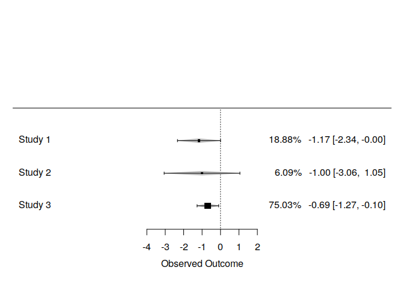
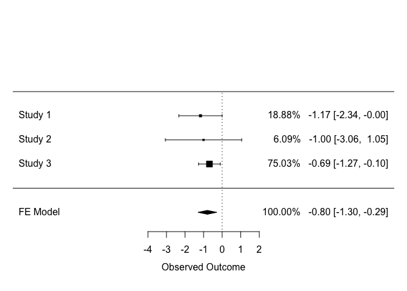

<!-- README.md is generated from README.Rmd. Please edit that file -->

# metawho

[](https://ci.appveyor.com/project/ShixiangWang/metawho)
[](https://travis-ci.org/ShixiangWang/metawho)
[](https://codecov.io/github/ShixiangWang/metawho?branch=master)

The goal of **metawho** is to provide simple R implementation of
“Meta-analytical method to Identify Who Benefits Most from Treatments”
(called ‘deft’ approach, see [reference \#2](#references)).

**metawho** is powered by R package **metafor** and does not support
dataset contains individuals for now. Please use stata package
**ipdmetan** if you are more familar with stata code.

## Installation

You can install the development version of **metawho** from GitHub with:

``` r
remotes::install_github("ShixiangWang/metawho")
```

## Example

This is a basic example which shows you how to solve a common problem.

Load example data.

``` r
library(metawho)
#> Loading required package: metafor
#> Loading required package: Matrix
#> Loading 'metafor' package (version 2.0-0). For an overview 
#> and introduction to the package please type: help(metafor).
data("wang2019")

wang2019
#>                  entry         trial subgroup         yi       sei
#> 1      Rizvi 2015-Male    Rizvi 2015     Male -1.2039728 0.6142718
#> 2    Rizvi 2015-Female    Rizvi 2015   Female -2.2072749 0.8500522
#> 3      Rizvi 2018-Male    Rizvi 2018     Male  0.2231436 0.2143635
#> 4    Rizvi 2018-Female    Rizvi 2018   Female -0.4620355 0.2082161
#> 5   Hellmann 2018-Male Hellmann 2018     Male -0.1053605 0.4029931
#> 6 Hellmann 2018-Female Hellmann 2018   Female -1.2729657 0.4387209
```

Use `deft_do()` function to obtain model results.

``` r
# The 'Male' is the reference
(res = deft_do(wang2019, group_level = c("Male", "Female")))
#> $all
#> $all$data
#>                  entry         trial subgroup         yi       sei
#> 1      Rizvi 2015-Male    Rizvi 2015     Male -1.2039728 0.6142718
#> 2    Rizvi 2015-Female    Rizvi 2015   Female -2.2072749 0.8500522
#> 3      Rizvi 2018-Male    Rizvi 2018     Male  0.2231436 0.2143635
#> 4    Rizvi 2018-Female    Rizvi 2018   Female -0.4620355 0.2082161
#> 5   Hellmann 2018-Male Hellmann 2018     Male -0.1053605 0.4029931
#> 6 Hellmann 2018-Female Hellmann 2018   Female -1.2729657 0.4387209
#> 
#> $all$model
#> 
#> Fixed-Effects with Moderators Model (k = 6)
#> 
#> Test for Residual Heterogeneity: 
#> QE(df = 0) = 0.0000, p-val = 1.0000
#> 
#> Test of Moderators (coefficient(s) 1:6): 
#> QM(df = 6) = 25.0790, p-val = 0.0003
#> 
#> Model Results:
#> 
#>                            estimate      se     zval    pval    ci.lb
#> entryHellmann 2018-Female   -1.2730  0.4387  -2.9015  0.0037  -2.1328
#> entryHellmann 2018-Male     -0.1054  0.4030  -0.2614  0.7937  -0.8952
#> entryRizvi 2015-Female      -2.2073  0.8501  -2.5966  0.0094  -3.8733
#> entryRizvi 2015-Male        -1.2040  0.6143  -1.9600  0.0500  -2.4079
#> entryRizvi 2018-Female      -0.4620  0.2082  -2.2190  0.0265  -0.8701
#> entryRizvi 2018-Male         0.2231  0.2144   1.0410  0.2979  -0.1970
#>                              ci.ub    
#> entryHellmann 2018-Female  -0.4131  **
#> entryHellmann 2018-Male     0.6845    
#> entryRizvi 2015-Female     -0.5412  **
#> entryRizvi 2015-Male       -0.0000   *
#> entryRizvi 2018-Female     -0.0539   *
#> entryRizvi 2018-Male        0.6433    
#> 
#> ---
#> Signif. codes:  0 '***' 0.001 '**' 0.01 '*' 0.05 '.' 0.1 ' ' 1 
#> 
#> 
#> 
#> $subgroup
#> $subgroup$data
#>           trial        hr      ci.lb     ci.ub   conf_q        yi
#> 1 Hellmann 2018 0.3111111 0.09679207 0.9999798 1.959964 -1.167605
#> 2    Rizvi 2015 0.3666667 0.04694148 2.8640863 1.959964 -1.003302
#> 3    Rizvi 2018 0.5040000 0.28058020 0.9053240 1.959964 -0.685179
#>         sei
#> 1 0.5957176
#> 2 1.0487700
#> 3 0.2988405
#> 
#> $subgroup$model
#> 
#> Fixed-Effects with Moderators Model (k = 3)
#> 
#> Test for Residual Heterogeneity: 
#> QE(df = 0) = 0.0000, p-val = 1.0000
#> 
#> Test of Moderators (coefficient(s) 1:3): 
#> QM(df = 3) = 10.0137, p-val = 0.0185
#> 
#> Model Results:
#> 
#>                     estimate      se     zval    pval    ci.lb    ci.ub   
#> trialHellmann 2018   -1.1676  0.5957  -1.9600  0.0500  -2.3352  -0.0000  *
#> trialRizvi 2015      -1.0033  1.0488  -0.9566  0.3387  -3.0589   1.0522   
#> trialRizvi 2018      -0.6852  0.2988  -2.2928  0.0219  -1.2709  -0.0995  *
#> 
#> ---
#> Signif. codes:  0 '***' 0.001 '**' 0.01 '*' 0.05 '.' 0.1 ' ' 1 
#> 
#> 
#> 
#> attr(,"class")
#> [1] "deft"
```

Plot the results with `forest()` function from **metafor** package.

``` r
forest(res$subgroup$model, showweights = TRUE)
```



Modify plot, more see `?forest.rma`.

``` r
forest(res$subgroup$model, showweights = TRUE, atransf = exp, 
       slab = res$subgroup$data$trial,
       xlab = "Hazard ratio")
op = par(no.readonly = TRUE)
par(cex = 0.75, font = 2)
text(-11.5, 4.5, "Trial(s) and subgroup", pos = 4)
text(9, 4.5, "Hazard Risk [95% CI]", pos = 2)
```



``` r
par(op)
```

## References

  - Wang, Shixiang, et al. “The predictive power of tumor mutational
    burden in lung cancer immunotherapy response is influenced by
    patients’ sex.” International journal of cancer (2019).
  - Fisher, David J., et al. “Meta-analytical methods to identify who
    benefits most from treatments: daft, deluded, or deft approach?.”
    bmj 356 (2017): j573.
